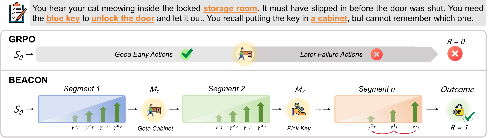
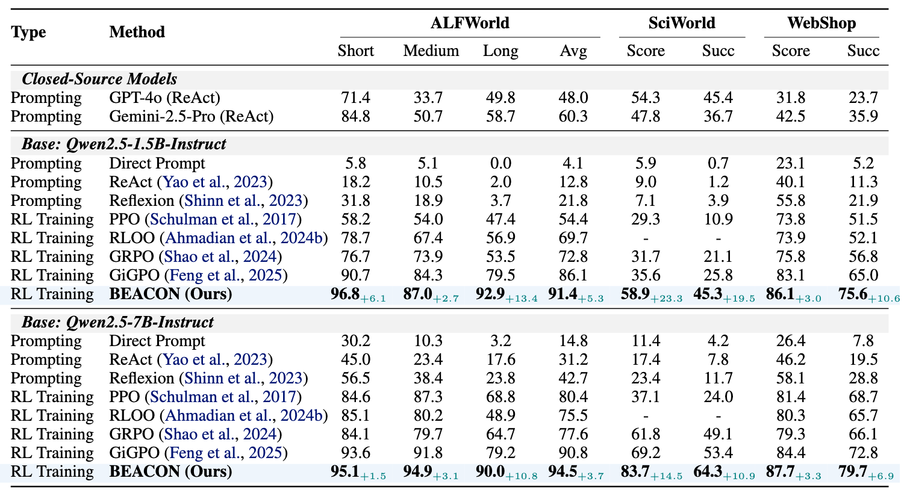
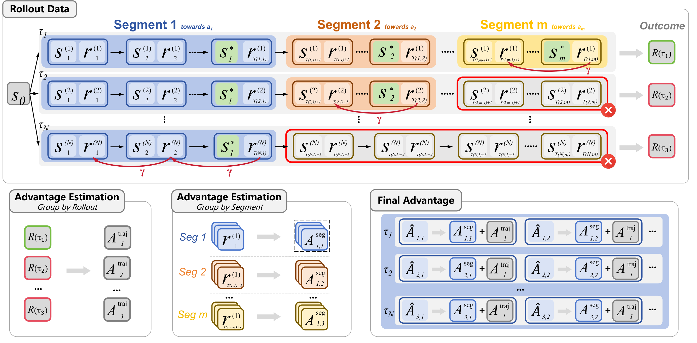

<p align="center">
  
</p>

<h2 align="center">BEACON: Milestone-Guided Policy Learning for Long-Horizon Language Agents</h2>

<p align="center">
  <a href="https://github.com/ZJU-REAL/BEACON"></a>
  
  
</p>

<p align="center">
  Zixuan Wang, Yuchen Yan, Hongxing Li, Teng Pan, Dingming Li, Ruiqing Zhang,<br>
  Weiming Lu, Jun Xiao, Yueting Zhuang, Yongliang Shen<sup>†</sup><br>
  <em>Zhejiang University &nbsp;·&nbsp; Baidu Inc.</em>
</p>

<p align="center">
  
</p>

This repository contains the official implementation of **BEACON**, a milestone-guided policy learning framework that addresses two pathologies of trajectory-level RL on long-horizon language-agent tasks: **credit misattribution** (correct early actions penalized by terminal failure) and **sample inefficiency** (partial successes wasted under sparse rewards). The implementation is built on top of [verl-agent](https://github.com/langfengQ/verl-agent); only the components contributed by this work are documented here.

## Highlights

- **Consistent gains on three long-horizon benchmarks** with a single set of hyperparameters ($\gamma=0.95$, $\lambda=1.0$).
- **Horizon-dependent gains.** On ALFWorld Long tasks, BEACON reaches **92.9%** vs. **53.5%** for GRPO. Relative gains over GRPO scale from +26.2% (Short) to +73.6% (Long).
- **Recovers learning signal from partial successes.** Effective sample utilization improves from **23.7%** to **82.0%** on ALFWorld.
- **Outperforms behavior cloning.** 91.4% vs. 43% for SFT on oracle trajectories — gains stem from policy optimization, not milestone imitation.

<p align="center">
  <br>
  <sub><b>Main results.</b> BEACON outperforms GRPO and GiGPO across ALFWorld, ScienceWorld, and WebShop at both 1.5B and 7B scales.</sub>
</p>

## Method

<p align="center">
  
</p>

BEACON operates in three stages:

1. **Trajectory partitioning.** A milestone indicator $\Phi$ identifies verifiable subgoal-completion transitions, splitting each trajectory into segments at milestone boundaries. $\Phi$ is environment-defined and requires no learned model: ALFWorld uses object/state predicates, WebShop uses page-transition phases, ScienceWorld exposes `subgoal_completed` directly.
2. **Temporal reward shaping.** Within each completed segment, actions receive shaped reward $r_t = R_{\text{ms}} \cdot \gamma^{t_k - t}$, giving graduated positive credit to actions leading up to a milestone and converting partial successes into learning signal.
3. **Dual-scale advantage estimation.** Trajectory-level advantage (GRPO-style) captures global task performance; segment-level advantage compares only among trajectories that reached the same milestone, isolating local action quality from variance in later segments. The two are combined as $\hat{A}_{i,t} = A^{\text{traj}}_i + \lambda \cdot A^{\text{seg}}_{i,t}$.

At update time, BEACON automatically routes each batch based on which milestone field is present (`trial_id` for ALFWorld, `milestone_achieved` for WebShop, `subgoal_completed` for ScienceWorld), so a single training pipeline supports all three environments without environment-specific code paths in the trainer.

## Repository layout

```
migpo/                   # BEACON core: advantage / step-reward computation and milestone detector
agent_system/            # ALFWorld, WebShop, and ScienceWorld environment integrations
examples/migpo_trainer/  # Paper-locked training scripts (one per environment)
```

Everything else is inherited from the upstream [verl-agent](https://github.com/langfengQ/verl-agent) framework.

## Installation

### 1. Base framework

```bash
conda create -n verl-agent python==3.12 -y
conda activate verl-agent

pip3 install torch==2.6.0 --index-url https://download.pytorch.org/whl/cu124
pip3 install flash-attn==2.7.4.post1 --no-build-isolation
pip3 install -e .
pip3 install vllm==0.8.5
```

> Each environment below is best installed in its own dedicated conda environment to avoid dependency conflicts.

### 2. ALFWorld

```bash
pip3 install gymnasium==0.29.1
pip3 install stable-baselines3==2.6.0
pip install alfworld
pip install vllm==0.8.5

# Download PDDL & Game files and the pre-trained MaskRCNN detector
alfworld-download -f
```

### 3. WebShop

WebShop requires Python ≤ 3.10:

```bash
conda create -n verl-agent-webshop python==3.10 -y
conda activate verl-agent-webshop

cd ./agent_system/environments/env_package/webshop/webshop
./setup.sh -d all

cd repo_root/
pip3 install torch==2.6.0 --index-url https://download.pytorch.org/whl/cu124
pip3 install flash-attn==2.7.4.post1 --no-build-isolation
pip3 install -e .
pip3 install vllm==0.8.2
```

### 4. ScienceWorld

ScienceWorld requires Java 1.8+ and Python ≤ 3.10:

```bash
conda create -n verl-agent-sciworld python==3.10 -y
conda activate verl-agent-sciworld

cd repo_root/
pip3 install torch==2.6.0+cu124 --index-url https://download.pytorch.org/whl/cu124
pip3 install flash-attn==2.7.4.post1 --no-build-isolation
pip3 install -e .
pip3 install vllm==0.8.2

# Java via conda (not system-wide)
conda install -c conda-forge openjdk=11 -y

# ScienceWorld ships its own bundled JAR and the py4j bridge
pip install scienceworld
```

Variation indices used by our experiments are included at `agent_system/environments/env_package/sciworld/variations_idx/`.

Sanity check:

```bash
python -c "from scienceworld import ScienceWorldEnv; print('ScienceWorld import successful')"
```

## Training

Paper-locked training scripts (Qwen2.5-1.5B-Instruct, single 8-GPU node) live in [`examples/migpo_trainer/`](./examples/migpo_trainer/):

```bash
bash examples/migpo_trainer/run_alfworld.sh    # ALFWorld
bash examples/migpo_trainer/run_webshop.sh     # WebShop
bash examples/migpo_trainer/run_sciworld.sh    # ScienceWorld
```

## Acknowledgement

This codebase builds on [verl-agent](https://github.com/langfengQ/verl-agent), which itself extends [veRL](https://github.com/volcengine/verl). We thank the authors of those projects, and the maintainers of the supported environments — [ALFWorld](https://github.com/alfworld/alfworld), [WebShop](https://github.com/princeton-nlp/WebShop), and [ScienceWorld](https://github.com/allenai/ScienceWorld).

## Citation

Coming soon.
